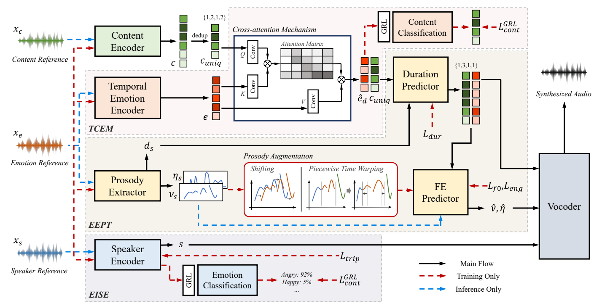

## Abstract
Emotional voice conversion (EVC) aims to modify the emotional style of speech while preserving its linguistic content. In practical EVC, controllability, the ability to independently control speaker identity and emotional style using distinct references, is crucial. However, existing methods often struggle to fully disentangle these attributes and lack the ability to model fine-grained emotional expressions such as temporal dynamics. We propose Maestro-EVC, a controllable EVC framework that enables independent control of content, speaker identity, and emotion by effectively disentangling each attribute from separate references. We further introduce a temporal emotion representation and an explicit prosody modeling with prosody augmentation to robustly capture and transfer the temporal dynamics of the target emotion, even under prosody mismatched conditions. Experimental results confirm that Maestro-EVC achieves high-quality, controllable, and emotionally expressive speech synthesis.

  
  

## Demo
The content, speaker, and emotion reference were randomly selected, and thus each may contain different content, speakers, and emotions.
### Compare with Baseline Models
<table>
        <thead>
            <tr>
              <th style="width: 16.66%; text-align: center;"><strong>Content</strong></th>
              <th style="width: 16.66%; text-align: center;"><strong>Speaker</strong></th>
              <th style="width: 16.66%; text-align: center; border-right: 3px double lightgray;"><strong>Emotion</strong></th>
              <th style="width: 16.66%; text-align: center;"><strong>MaestroEVC</strong></th>
              <th style="width: 16.66%; text-align: center;"><strong>ZEST</strong></th>
              <th style="width: 16.66%; text-align: center;"><strong>StyleVC</strong></th>
            </tr>
        </thead>

        <tbody>
            <tr>
                <td style="width: 300px; text-align: center;"><audio src="./audio/sample6/Happy_0017_000744.wav" controls="" preload="" style="width: 100%;"></audio></td>
                <td style="width: 300px; text-align: center;"><audio src="./audio/sample6/Happy_0020_000795.wav" controls="" preload="" style="width: 100%;"></audio></td>
                <td style="width: 300px; text-align: center; border-right: 3px double lightgray;"><audio src="./audio/sample6/Angry_0013_000692.wav" controls="" preload="" style="width: 100%;"></audio></td>
                <td style="width: 300px; text-align: center;"><audio src="./audio/sample6/src_Happy_0017_000744.wav_spk_Happy_0020_000795.wav_emo_Angry_0013_000692.wav" controls="" preload="" style="width: 100%;"></audio></td>
                <td style="width: 300px; text-align: center;"><audio src="./audio/sample6/zest.wav" controls="" preload="" style="width: 100%;"></audio></td>
                <td style="width: 300px; text-align: center;"><audio src="./audio/sample6/StyleVC.wav" controls="" preload="" style="width: 100%;"></audio></td>
            </tr>
            <tr>
                <td style="width: 300px; text-align: center;"><audio src="./audio/sample7/Neutral_0019_000170.wav" controls="" preload="" style="width: 100%;"></audio></td>
                <td style="width: 300px; text-align: center;"><audio src="./audio/sample7/Surprise_0012_001699.wav" controls="" preload="" style="width: 100%;"></audio></td>
                <td style="width: 300px; text-align: center; border-right: 3px double lightgray;"><audio src="./audio/sample7/Surprise_0013_001624.wav" controls="" preload="" style="width: 100%;"></audio></td>
                <td style="width: 300px; text-align: center;"><audio src="./audio/sample7/src_Neutral_0019_000170.wav_spk_Surprise_0012_001699.wav_emo_Surprise_0013_001624.wav" controls="" preload="" style="width: 100%;"></audio></td>
                <td style="width: 300px; text-align: center;"><audio src="./audio/sample7/zest.wav" controls="" preload="" style="width: 100%;"></audio></td>
                <td style="width: 300px; text-align: center;"><audio src="./audio/sample7/StyleVC.wav" controls="" preload="" style="width: 100%;"></audio></td>
            </tr>
            <tr>
                <td style="width: 300px; text-align: center;"><audio src="./audio/sample8/Sad_0016_001348.wav" controls="" preload="" style="width: 100%;"></audio></td>
                <td style="width: 300px; text-align: center;"><audio src="./audio/sample8/Happy_0019_000754.wav" controls="" preload="" style="width: 100%;"></audio></td>
                <td style="width: 300px; text-align: center; border-right: 3px double lightgray;"><audio src="./audio/sample8/Happy_0012_000937.wav" controls="" preload="" style="width: 100%;"></audio></td>
                <td style="width: 300px; text-align: center;"><audio src="./audio/sample8/src_Sad_0016_001348.wav_spk_Happy_0019_000754.wav_emo_Happy_0012_000937.wav" controls="" preload="" style="width: 100%;"></audio></td>
                <td style="width: 300px; text-align: center;"><audio src="./audio/sample8/zest.wav" controls="" preload="" style="width: 100%;"></audio></td>
                <td style="width: 300px; text-align: center;"><audio src="./audio/sample8/StyleVC.wav" controls="" preload="" style="width: 100%;"></audio></td>
            </tr>
            <tr>
                <td style="width: 300px; text-align: center;"><audio src="./audio/sample9/Sad_0020_001211.wav" controls="" preload="" style="width: 100%;"></audio></td>
                <td style="width: 300px; text-align: center;"><audio src="./audio/sample9/Surprise_0016_001620.wav" controls="" preload="" style="width: 100%;"></audio></td>
                <td style="width: 300px; text-align: center; border-right: 3px double lightgray;"><audio src="./audio/sample9/Angry_0012_000664.wav" controls="" preload="" style="width: 100%;"></audio></td>
                <td style="width: 300px; text-align: center;"><audio src="./audio/sample9/src_Sad_0020_001211.wav_spk_Surprise_0016_001620.wav_emo_Angry_0012_000664.wav" controls="" preload="" style="width: 100%;"></audio></td>
                <td style="width: 300px; text-align: center;"><audio src="./audio/sample9/zest.wav" controls="" preload="" style="width: 100%;"></audio></td>
                <td style="width: 300px; text-align: center;"><audio src="./audio/sample9/StyleVC.wav" controls="" preload="" style="width: 100%;"></audio></td>
            </tr>
            <tr>
                <td style="width: 300px; text-align: center;"><audio src="./audio/sample1/Happy_0012_000934.wav" controls="" preload="" style="width: 100%;"></audio></td>
                <td style="width: 300px; text-align: center;"><audio src="./audio/sample1/Sad_0019_001161.wav" controls="" preload="" style="width: 100%;"></audio></td>
                <td style="width: 300px; text-align: center; border-right: 3px double lightgray;"><audio src="./audio/sample1/Surprise_0020_001552.wav" controls="" preload="" style="width: 100%;"></audio></td>
                <td style="width: 300px; text-align: center;"><audio src="./audio/sample1/src_Happy_0012_000934.wav_spk_Sad_0019_001161.wav_emo_Surprise_0020_001552.wav" controls="" preload="" style="width: 100%;"></audio></td>
                <td style="width: 300px; text-align: center;"><audio src="./audio/sample1/zest.wav" controls="" preload="" style="width: 100%;"></audio></td>
                <td style="width: 300px; text-align: center;"><audio src="./audio/sample1/StyleVC.wav" controls="" preload="" style="width: 100%;"></audio></td>
            </tr>

            <tr>
                <td style="width: 300px; text-align: center;"><audio src="./audio/sample2/Neutral_0012_000338.wav" controls="" preload="" style="width: 100%;"></audio></td>
                <td style="width: 300px; text-align: center;"><audio src="./audio/sample2/Surprise_0015_001565.wav" controls="" preload="" style="width: 100%;"></audio></td>
                <td style="width: 300px; text-align: center; border-right: 3px double lightgray;"><audio src="./audio/sample2/Sad_0020_001310.wav" controls="" preload="" style="width: 100%;"></audio></td>
                <td style="width: 300px; text-align: center;"><audio src="./audio/sample2/src_Neutral_0012_000338.wav_spk_Surprise_0015_001565.wav_emo_Sad_0020_001310.wav" controls="" preload="" style="width: 100%;"></audio></td>
                <td style="width: 300px; text-align: center;"><audio src="./audio/sample2/zest.wav" controls="" preload="" style="width: 100%;"></audio></td>
                <td style="width: 300px; text-align: center;"><audio src="./audio/sample2/StyleVC.wav" controls="" preload="" style="width: 100%;"></audio></td>
            </tr>
            <tr>
                <td style="width: 300px; text-align: center;"><audio src="./audio/sample3/Surprise_0014_001746.wav" controls="" preload="" style="width: 100%;"></audio></td>
                <td style="width: 300px; text-align: center;"><audio src="./audio/sample3/Angry_0011_000612.wav" controls="" preload="" style="width: 100%;"></audio></td>
                <td style="width: 300px; text-align: center; border-right: 3px double lightgray;"><audio src="./audio/sample3/Angry_0012_000435.wav
" controls="" preload="" style="width: 100%;"></audio></td>
                <td style="width: 300px; text-align: center;"><audio src="./audio/sample3/src_Surprise_0014_001746.wav_spk_Angry_0011_000612.wav_emo_Angry_0012_000435.wav" controls="" preload="" style="width: 100%;"></audio></td>
                <td style="width: 300px; text-align: center;"><audio src="./audio/sample3/zest.wav" controls="" preload="" style="width: 100%;"></audio></td>
                <td style="width: 300px; text-align: center;"><audio src="./audio/sample3/StyleVC.wav" controls="" preload="" style="width: 100%;"></audio></td>
            </tr>
            <tr>
                <td style="width: 300px; text-align: center;"><audio src="./audio/sample4/Surprise_0015_001743.wav" controls="" preload="" style="width: 100%;"></audio></td>
                <td style="width: 300px; text-align: center;"><audio src="./audio/sample4/Neutral_0017_000326.wav" controls="" preload="" style="width: 100%;"></audio></td>
                <td style="width: 300px; text-align: center; border-right: 3px double lightgray;"><audio src="./audio/sample4/Neutral_0017_000326
.wav" controls="" preload="" style="width: 100%;"></audio></td>
                <td style="width: 300px; text-align: center;"><audio src="./audio/sample4/src_Surprise_0015_001743.wav_spk_Happy_0018_001030.wav_emo_Neutral_0017_000326.wav" controls="" preload="" style="width: 100%;"></audio></td>
                <td style="width: 300px; text-align: center;"><audio src="./audio/sample4/zest.wav" controls="" preload="" style="width: 100%;"></audio></td>
                <td style="width: 300px; text-align: center;"><audio src="./audio/sample4/StyleVC.wav" controls="" preload="" style="width: 100%;"></audio></td>
            </tr>
            <tr>
                <td style="width: 300px; text-align: center;"><audio src="./audio/sample5/Angry_0019_000361.wav" controls="" preload="" style="width: 100%;"></audio></td>
                <td style="width: 300px; text-align: center;"><audio src="./audio/sample5/Neutral_0014_000246.wav" controls="" preload="" style="width: 100%;"></audio></td>
                <td style="width: 300px; text-align: center; border-right: 3px double lightgray;"><audio src="./audio/sample5/Sad_0015_001295
.wav" controls="" preload="" style="width: 100%;"></audio></td>
                <td style="width: 300px; text-align: center;"><audio src="./audio/sample5/src_Angry_0019_000361.wav_spk_Neutral_0014_000246.wav_emo_Sad_0015_001295.wav" controls="" preload="" style="width: 100%;"></audio></td>
                <td style="width: 300px; text-align: center;"><audio src="./audio/sample5/zest.wav" controls="" preload="" style="width: 100%;"></audio></td>
                <td style="width: 300px; text-align: center;"><audio src="./audio/sample5/StyleVC.wav" controls="" preload="" style="width: 100%;"></audio></td>
            </tr>
            

        </tbody>
    </table>
   

